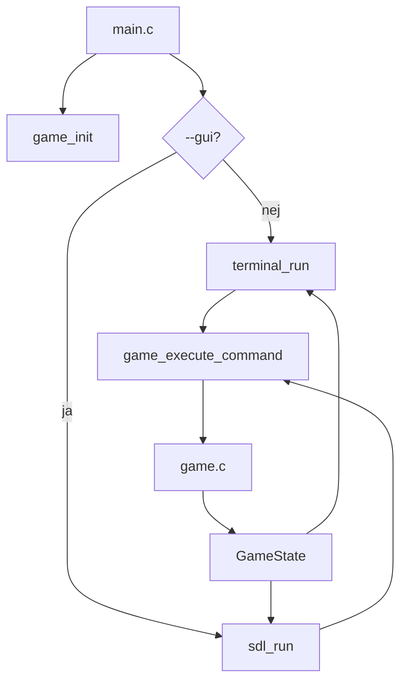

# Teknisk rapport

**02322 Machine Oriented Programming**  
**Danmarks Tekniske Universitet (DTU)**  
**Project 2: Yukon Solitaire i C**

**Studerende:** TODO: indsæt navn(e), studienummer og gruppe  
**Dato:** 24. april 2026  
**Repository:** `project2`

## Resumé

Denne rapport beskriver udviklingen af et Yukon Solitaire-program skrevet i C som del af kurset 02322 Machine Oriented Programming på DTU. Projektet implementerer en fælles spilmotor, en terminalbaseret brugergrænseflade og en grafisk brugergrænseflade baseret på SDL3. Programmet understøtter indlæsning og validering af kortspil, blanding, gemning, start af spil, flyt af kort mellem kolonner og foundations samt detektion af gennemført spil.

Den centrale designbeslutning er at adskille spilogik fra brugergrænsefladerne. Terminalversionen og SDL-versionen anvender derfor samme `GameState` og samme funktioner til validering og udførelse af kommandoer. Dette reducerer duplikering og gør det lettere at sikre ens regler på tværs af brugerflader.

## Bidrag

TODO: Udfyld de præcise individuelle bidrag før aflevering.

| Bidragyder | Bidrag til kode | Bidrag til rapport |
| --- | --- | --- |
| TODO: navn | TODO: fx spilmotor, filhåndtering, terminal UI, SDL GUI, test | TODO: fx krav, design, implementation, tests |
| Generativ AI / ChatGPT / Codex | Har hjulpet med strukturering, forklaring, teknisk tekst, testforslag og gennemgang af kode. | Har udarbejdet denne rapportkladde ud fra kildekoden og projektets rapportkrav. |

## 1. Introduktion

Formålet med projektet er at udvikle en C-implementation af Yukon Solitaire med fokus på datastrukturer, filhåndtering, brugerinput, modularisering og lavniveau programstruktur. Programmet skal kunne anvendes i terminalen og via en grafisk SDL-brugerflade.

Yukon Solitaire består af syv tableau-kolonner og fire foundations. Kort kan flyttes mellem kolonner og fra kolonner til foundations efter bestemte regler. Projektet kræver derfor både repræsentation af et dynamisk spilbræt og validering af brugerens handlinger.

Rapporten beskriver først kravene til systemet, derefter analyse og design, efterfulgt af implementation og test. Til sidst diskuteres brugen af generativ AI i projektarbejdet.

## 2. Kravspecifikation

Systemet skal implementere en spilbar version af Yukon Solitaire med følgende funktionelle krav.

| ID | Krav | Beskrivelse | Status |
| --- | --- | --- | --- |
| F1 | Indlæs standard deck | Programmet skal kunne oprette et fuldt deck på 52 kort. | Implementeret med `LD`. |
| F2 | Indlæs deck fra fil | Programmet skal kunne læse et deck fra en tekstfil. | Implementeret med `LD <filnavn>`. |
| F3 | Valider deck | Programmet skal afvise ugyldige kort, dubletter og forkert deckstørrelse. | Implementeret. |
| F4 | Vis kort | Programmet skal kunne vise aktuel deck- eller spiltilstand. | Implementeret med `SW`, terminal-rendering og SDL-rendering. |
| F5 | Bland deck | Programmet skal kunne blande kort med interleaving og random insertion. | Implementeret med `SI`, `SI <split>` og `SR`. |
| F6 | Gem deck | Programmet skal kunne gemme aktuel deck-rækkefølge til fil. | Implementeret med `SD` og `SD <filnavn>`. |
| F7 | Start spil | Programmet skal kunne skifte fra startup til play og uddele kort. | Implementeret med `P`. |
| F8 | Flyt kort | Programmet skal validere og udføre flyt mellem kolonner og foundations. | Implementeret med tekstkommandoer og GUI-klik. |
| F9 | Afslut spil | Programmet skal kunne gå tilbage til startup eller afslutte programmet. | Implementeret med `Q` og `QQ`. |
| F10 | Registrer vundet spil | Programmet skal registrere, når alle 52 kort ligger i foundations. | Implementeret. |

De vigtigste ikke-funktionelle krav er:

- Koden skal være modulær og opdelt i spilmotor og brugergrænseflader.
- Programmet skal kunne bygges og køres på Windows.
- Fejl skal rapporteres med tydelige statusbeskeder.
- Brugergrænsefladerne skal anvende samme underliggende regler.
- Datastrukturerne skal kunne håndtere dynamiske flyt af kortsegmenter.

## 3. Analyse

Spillet kan analyseres som en tilstandsmaskine med to hovedfaser:

| Fase | Formål | Tilladte kommandoer |
| --- | --- | --- |
| `PHASE_STARTUP` | Klargøring af deck før spillet starter. | `LD`, `SW`, `SI`, `SR`, `SD`, `P`, `QQ` |
| `PHASE_PLAY` | Aktivt spil, hvor kort kan flyttes. | Flytkommandoer, GUI-flyt, `Q`, `QQ` |

Denne faseopdeling forhindrer eksempelvis, at brugeren blander eller indlæser et nyt deck midt i et aktivt spil. Det giver en tydeligere programstruktur og gør kommandohåndteringen enklere.

Kortformatet er defineret som to tegn:

- Første tegn er rank: `A`, `2`, `3`, ..., `9`, `T`, `J`, `Q`, `K`.
- Andet tegn er suit: `C`, `D`, `H`, `S`.

Eksempler på gyldige kort er `AC`, `TD` og `KS`. Et deck er kun gyldigt, hvis det indeholder præcis 52 unikke kort.

En central observation er, at kort i Yukon ofte flyttes som sammenhængende segmenter. Derfor er linked lists velegnede til kolonnerne, fordi et segment kan løsnes og kobles på en anden liste uden at flytte alle kort enkeltvis i et array.

## 4. Systemdesign

Systemet er opdelt i en spilmotor og to brugergrænseflader.

| Modul | Filer | Ansvar |
| --- | --- | --- |
| Spilmotor | `include/game.h`, `src/game.c` | Spiltilstand, kort, decks, flytteregler, shuffle, filhåndtering og win detection. |
| Terminal UI | `include/terminal_ui.h`, `src/terminal_ui.c` | Tekstbaseret rendering og kommandoløkke. |
| SDL UI | `include/sdl_ui.h`, `src/sdl_ui.c` | Grafisk rendering, knapper, korttegning, promptfelter og museinput. |
| Programstart | `src/main.c` | Initialisering og valg mellem terminal og GUI. |

### 4.1 Overordnet arkitektur



Begge brugergrænseflader sender kommandoer eller handlinger ind i spilmotoren. Spilmotoren opdaterer `GameState`, hvorefter brugergrænsefladen renderer den nye tilstand.

### 4.2 Datastrukturdesign

De vigtigste datatyper er:

| Type | Beskrivelse |
| --- | --- |
| `Card` | Indeholder rank, suit og synlighedsflag. |
| `CardNode` | Node i linked list med et kort og pointer til næste node. |
| `CardList` | Linked list med `head`, `tail` og `count`. |
| `GameState` | Samlet spiltilstand for deck, kolonner, foundations, fase, beskeder og win-status. |

`GameState` fungerer som programmets centrale model. Brugergrænsefladerne læser fra denne model, mens spilmotoren er ansvarlig for at ændre den.

### 4.3 Kommando-flow

```text
game_execute_command(command):
    gem command som last_command

    hvis command == "QQ":
        stop programmet
    hvis command matcher LD:
        indlæs default deck eller fildeck
    hvis command matcher SW:
        vis deck
    hvis command matcher SD:
        gem deck til fil
    hvis command matcher SI eller SR:
        bland deck
    hvis command == "P":
        start play-fase
    hvis command == "Q":
        vend tilbage til startup
    hvis command indeholder "->":
        udfør flyt
    ellers:
        vis fejlbesked
```

### 4.4 Flyttealgoritme

Flyt analyseres i tre trin: parsing, validering og udførelse.

```text
game_move_command(command):
    kræv at spillet er i PLAY
    split command ved "->"
    parse source som kolonne eller foundation
    parse destination som kolonne eller foundation
    find kortet eller segmentet der skal flyttes
    valider destinationens regler
    detach segment fra source
    append segment på destination
    vend nyt nederste kort i source-kolonnen
    opdater win-state
```

Ved flyt til foundation må kun et enkelt øverste kort flyttes. Ved flyt til kolonne kan et synligt segment flyttes.

## 5. Implementation

### 5.1 Initialisering og programstart

Programmet starter i `main.c`. Først initialiseres en `GameState` med `game_init`. Hvis programmet startes med argumentet `--gui`, køres SDL-versionen. Ellers køres terminalversionen.

```c
if (argc > 1 && strcmp(argv[1], "--gui") == 0) {
    exit_code = sdl_run(&game, smoke_test);
} else {
    terminal_run(&game);
}
```

Efter programmet afsluttes, kaldes `game_destroy`, som frigør linked lists og dermed dynamisk allokeret hukommelse.

### 5.2 Deck og filhåndtering

`game_load_default_deck` opretter 52 kort ud fra de definerede ranks og suits. `game_load_deck_file` læser et kort per linje og validerer inputtet. Der bruges et todimensionelt `seen`-array til at opdage dubletter.

Valideringen kontrollerer:

- linjelængde,
- gyldig rank,
- gyldig suit,
- dubletter,
- samlet antal kort.

Hvis filen ikke kan åbnes, returnerer programmet beskeden `File does not exist.`. Hvis et kort optræder flere gange, returneres eksempelvis `Duplicate card at line 2.`.

### 5.3 Uddeling af kort

Funktionen `rebuild_columns_from_deck` bygger tableau-kolonnerne ud fra deckets rækkefølge. Kolonnelængderne er defineret som:

```c
static const int COLUMN_LENGTHS[COLUMN_COUNT] = {1, 6, 7, 8, 9, 10, 11};
```

I startup-fasen er kortene skjulte. Når spillet startes med `P`, kaldes funktionen med play-synlighed, så de relevante kort bliver synlige.

### 5.4 Shuffle

Der er implementeret to shuffle-strategier:

| Funktion | Kommando | Beskrivelse |
| --- | --- | --- |
| `game_shuffle_interleave` | `SI` / `SI <split>` | Deler decket i to bunker og fletter kortene skiftevis. |
| `game_shuffle_random` | `SR` | Indsætter hvert kort på en tilfældig position i en ny bunke. |

Begge strategier arbejder direkte på linked lists ved at flytte noder i stedet for at kopiere kortdata.

### 5.5 Flytteregler

Flyt til foundation valideres med `can_place_on_foundation`. En tom foundation kræver et es, og efterfølgende kort skal have samme suit og en rank præcis én højere end topkortet.

Flyt til kolonne valideres med `can_place_on_column`. En tom kolonne kræver en konge. Ellers skal det flyttede kort have rank én lavere end destinationens nederste kort, og suit må ikke være den samme.

Bemærk: Hvis den endelige projektspecifikation kræver klassisk rød/sort alternering i stedet for forskellig suit, skal denne regel justeres.

### 5.6 Terminal UI

Terminalbrugerfladen renderer kolonnerne `C1` til `C7`, foundations `F1` til `F4`, sidste kommando og statusbesked. Kommandoer læses med `fgets`, hvorefter newline fjernes, og kommandoen sendes til `game_execute_command`.

Terminalversionen er nyttig til test, fordi kommandoer let kan pipe's ind i programmet.

### 5.7 SDL UI

SDL-versionen opretter et vindue på 1360x900 pixels. Den tegner:

- kontrolknapper,
- tableau-kolonner,
- foundations,
- kortforsider og kortbagsider,
- statuspanel,
- promptfelter til filnavn og splitværdi.

GUI'en understøtter både knapper og direkte musebaserede flyt. Når brugeren vælger et synligt kort, gemmes valget i en `GuiSelection`. Derefter kan brugeren klikke på en destination. GUI'en bruger spilmotorens valideringsfunktioner til at markere lovlige destinationer.

## 6. Build og kørsel

Projektet kan bygges med det medfølgende PowerShell-script via:

```powershell
.\run.bat
```

Terminalversionen køres med:

```powershell
.\run.bat
```

GUI-versionen køres med:

```powershell
.\gui.bat
```

Manuelt build blev testet med lokal Zig cache:

```powershell
$env:ZIG_GLOBAL_CACHE_DIR = Join-Path (Get-Location) '.zig-cache-global'
python -m ziglang cc -std=c11 -Wall -Wextra -pedantic src\game.c src\main.c src\sdl_ui.c src\terminal_ui.c -I include -I third_party\SDL3-3.2.24\include -L third_party\SDL3-3.2.24\lib\x64 -lSDL3 -o build\project2.exe
```

Buildet lykkedes uden compilerfejl.

## 7. Verifikation og test

Testene er udført manuelt via terminalversionen. Følgende input blev pipe't ind i programmet:

```text
LD valid_deck.txt
SW
SI 26
SD out.txt
P
Q
LD missing.txt
LD invalid_deck.txt
QQ
```

| Testcase | Forventet resultat | Observeret resultat | Vurdering |
| --- | --- | --- | --- |
| `LD valid_deck.txt` | Gyldigt deck indlæses. | `Message: OK`. | Bestået. |
| `SW` | Kortene vises åbent. | Kort som `AC`, `2C`, `3C` osv. blev vist. | Bestået. |
| `SI 26` | Deck blandes med split 26. | `Message: OK`. | Bestået. |
| `SD out.txt` | Aktuelt deck gemmes til fil. | `Message: OK`, og `out.txt` blev opdateret. | Bestået. |
| `P` | Spillet starter, og tableau vises i play-tilstand. | Kort blev uddelt med synlige og skjulte kort. | Bestået. |
| `Q` | Programmet vender tilbage til startup-fasen. | `Message: OK`, og kortene blev skjult igen. | Bestået. |
| `LD missing.txt` | Manglende fil afvises. | `Message: File does not exist.` | Bestået. |
| `LD invalid_deck.txt` | Dubletdeck afvises. | `Message: Duplicate card at line 2.` | Bestået. |

Følgende tests bør tilføjes før endelig aflevering:

- Test af `SR` med kontrol af 52 unikke kort.
- Test af ugyldige splitværdier som `SI 0`, `SI 52` og `SI abc`.
- Test af lovlige og ulovlige flyt til foundations.
- Test af lovlige og ulovlige flyt mellem kolonner.
- Test af GUI-knapper og GUI-museflyt.
- GUI smoke-test med `--gui --smoke-test`.

## 8. Diskussion

Projektets vigtigste styrke er modulariseringen. Ved at placere spillets regler i `game.c` kan både terminalen og GUI'en bruge samme validering. Det gør løsningen mere konsistent end en implementation, hvor reglerne kopieres ind i hver brugergrænseflade.

Linked lists passer godt til kortsegmenter, men de har også ulemper. Tilfældig adgang til et kort kræver lineær gennemløbning, hvilket ses i funktioner som `node_at`. For et spil med kun 52 kort er dette ikke et praktisk performanceproblem, men det er stadig en relevant designafvejning.

SDL-versionen giver en mere brugervenlig oplevelse, men den gør også programmet mere komplekst. Rendering, inputhåndtering og promptlogik fylder betydeligt mere end terminalversionen. Derfor er det en fordel, at GUI-koden ikke også indeholder de grundlæggende spilregler.

Der mangler automatiske unit tests. De manuelle tests viser, at centrale funktioner virker, men automatiserede tests ville gøre det lettere at opdage regressionsfejl i flytteregler og filvalidering.

## 9. Brug af generativ AI

Generativ AI blev anvendt som støtteværktøj i projektarbejdet. AI bidrog med strukturering af rapporten, forslag til testcases, forklaring af kode og formulering af tekniske afsnit.

AI var især nyttig til:

- at skabe overblik over kildekoden,
- at formulere tekniske beskrivelser,
- at foreslå en rapportstruktur,
- at identificere relevante testområder.

AI var ikke egnet som eneste kilde til korrekthed. Forslag fra AI skulle kontrolleres mod den faktiske kode, compiler-output og testkørsler. Det er derfor vigtigt, at den endelige rapport kun beskriver funktionalitet, der enten kan ses i koden eller er verificeret ved test.

I forhold til læring kan AI hjælpe med at forklare C-begreber som pointers, linked lists, memory management, headerfiler og modularisering. Den studerende skal dog stadig kunne redegøre for løsningen selv, da forståelse af implementationen er en central del af projektet.

## 10. Konklusion

Projektet implementerer en modulær C-version af Yukon Solitaire med både terminalbaseret og grafisk brugergrænseflade. Programmet kan indlæse, validere, blande og gemme decks, starte et spil, udføre validerede kortflyt og registrere, når spillet er vundet.

Spilmotoren er adskilt fra brugergrænsefladerne, hvilket giver en mere robust og vedligeholdelig struktur. Testene viser, at de centrale startup-kommandoer og filvalidering fungerer korrekt. Før endelig aflevering bør rapporten suppleres med præcise individuelle bidrag, screenshots og flere testcases for flytteregler og GUI.

## Appendix A: Kommandooversigt

| Kommando | Funktion |
| --- | --- |
| `LD` | Indlæs standard deck. |
| `LD <filnavn>` | Indlæs deck fra fil. |
| `SW` | Vis kort. |
| `SI` | Interleave shuffle med tilfældigt split. |
| `SI <split>` | Interleave shuffle med valgt split. |
| `SR` | Random insertion shuffle. |
| `SD` | Gem deck til `cards.txt`. |
| `SD <filnavn>` | Gem deck til valgt fil. |
| `P` | Start play-fase. |
| `Q` | Gå tilbage til startup-fase. |
| `QQ` | Afslut programmet. |
| `C1->F1` | Flyt nederste synlige kort fra kolonne 1 til foundation 1. |
| `C3:7H->C5` | Flyt synligt segment fra `7H` i kolonne 3 til kolonne 5. |
| `F1->C2` | Flyt øverste kort fra foundation 1 til kolonne 2. |

## Appendix B: Testfiler

`valid_deck.txt` indeholder 52 unikke kort, et kort per linje.

`invalid_deck.txt` indeholder:

```text
AC
AC
```

Denne fil bruges til at teste dubletdetektion.

## Appendix C: Manglende materiale før aflevering

- Navn(e), studienummer og gruppe.
- Fotos til forsiden, hvis det kræves.
- Præcis bidragsfordeling mellem gruppemedlemmer.
- Screenshots fra terminal og SDL GUI.
- Flere testcases for flytteregler.
